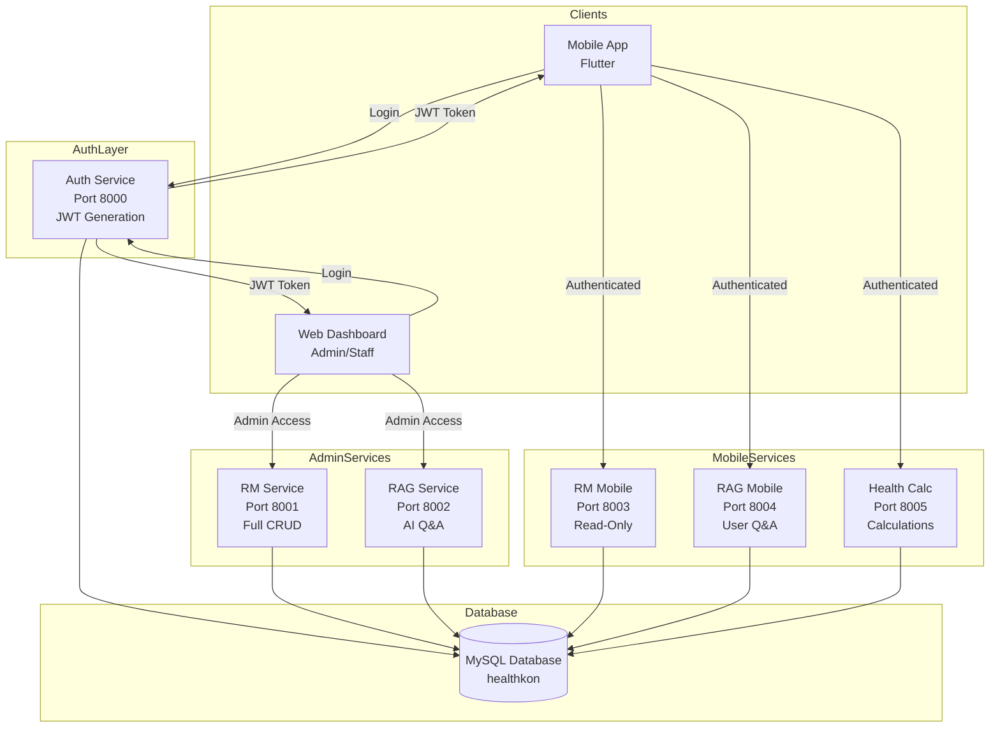
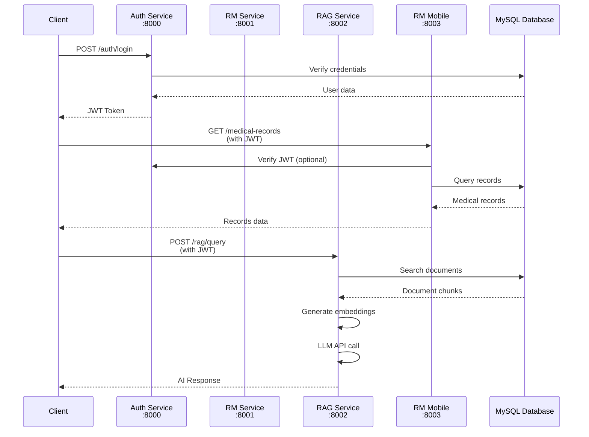
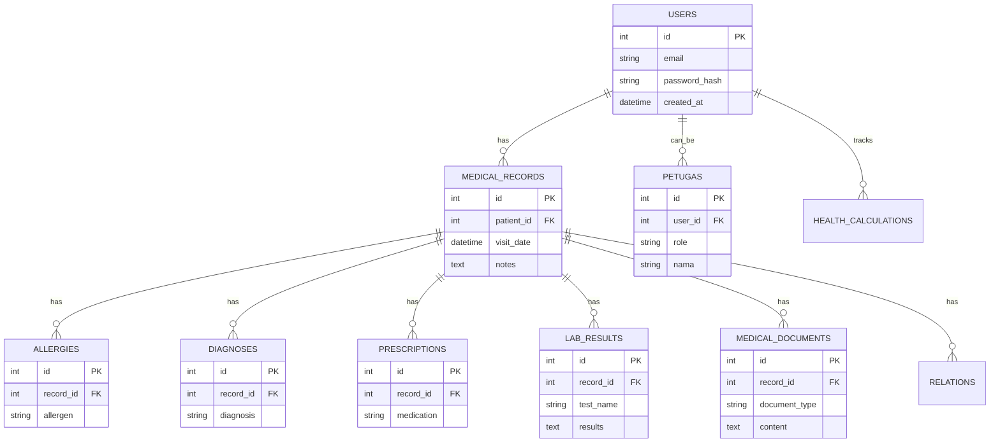
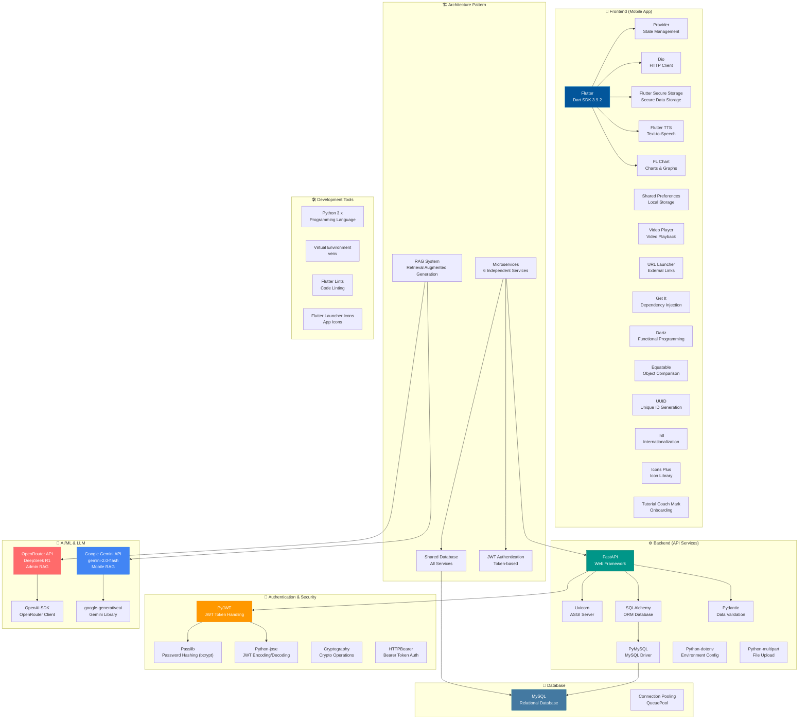
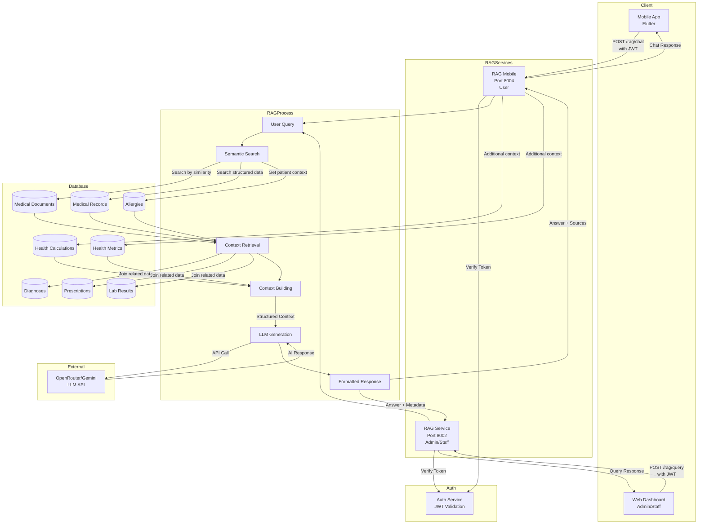
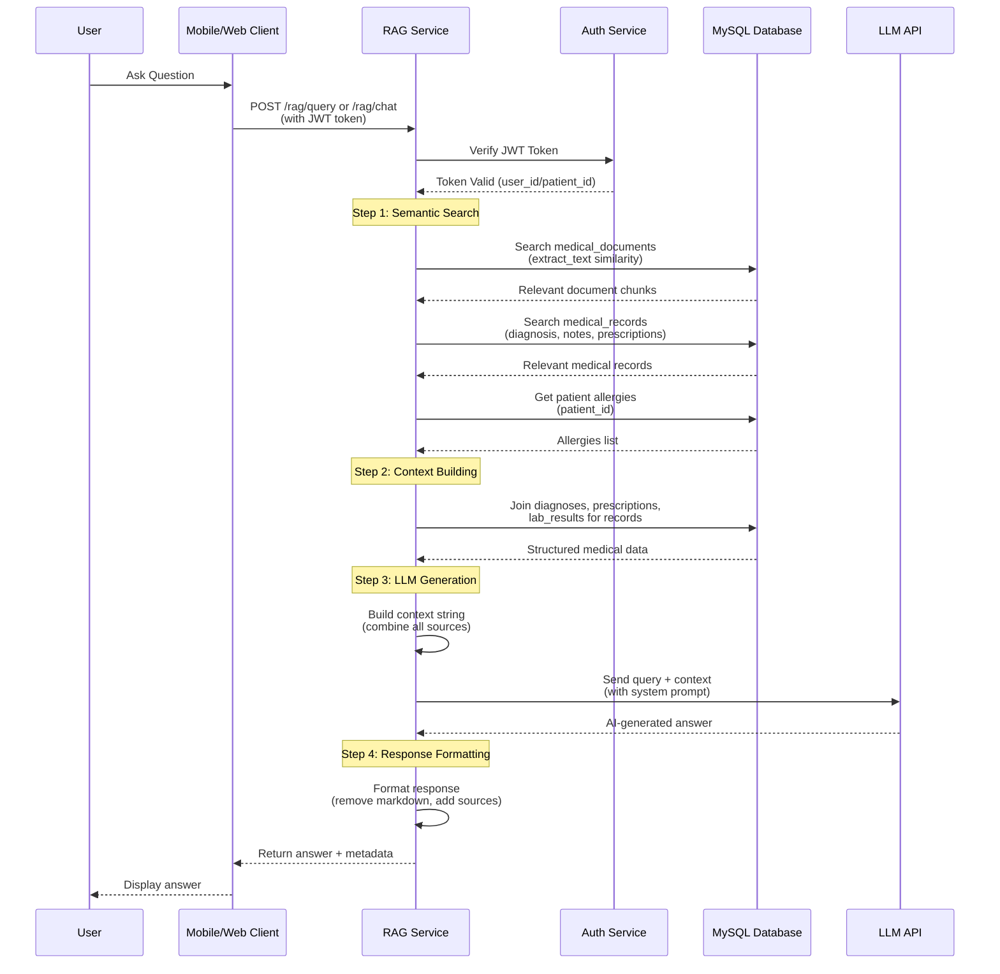
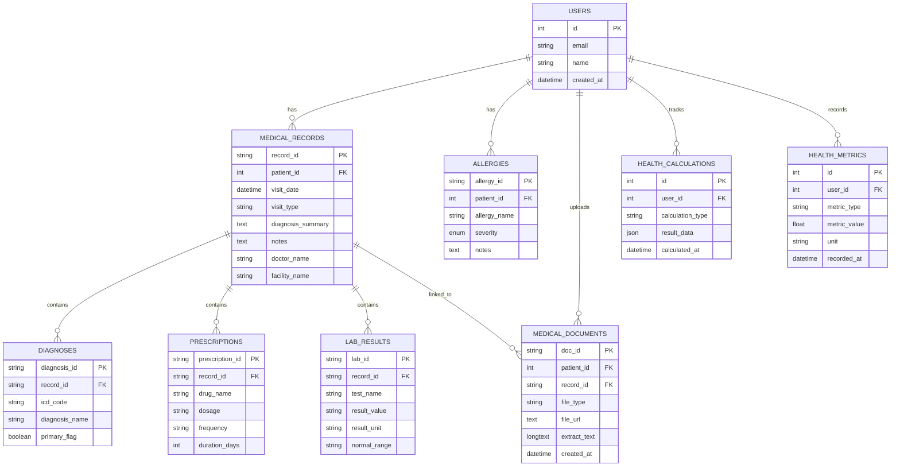
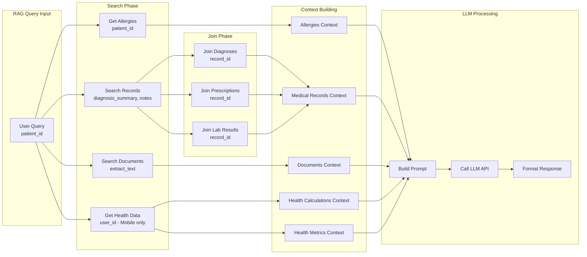

# Arsitektur Backend Healthkon BPJS

## 📋 Daftar Isi
1. [Overview](#overview)
2. [Arsitektur Mikroservice](#arsitektur-mikroservice)
3. [Diagram Arsitektur](#diagram-arsitektur)
4. [Detail Setiap Service](#detail-setiap-service)
5. [Database Architecture](#database-architecture)
6. [Komunikasi Antar Service](#komunikasi-antar-service)
7. [Teknologi yang Digunakan](#teknologi-yang-digunakan)

---

## Overview

Backend Healthkon BPJS menggunakan arsitektur **Microservices** dengan 6 service terpisah yang berjalan secara independen. Setiap service memiliki port dan fungsi spesifik, dengan pola **separation of concerns** yang jelas antara service untuk admin/staff dan service untuk user mobile.

### Karakteristik Arsitektur:
- ✅ **Microservices Architecture** - Setiap service independen
- ✅ **RESTful API** - Menggunakan FastAPI framework
- ✅ **Shared Database** - Semua service menggunakan database MySQL yang sama
- ✅ **JWT Authentication** - Token-based authentication
- ✅ **Service Separation** - Pemisahan service untuk admin dan mobile user

---

## Arsitektur Mikroservice

Arsitektur mikroservice menggunakan 6 service terpisah dengan pemisahan yang jelas antara service untuk admin/staff dan service untuk user mobile. Semua service menggunakan shared MySQL database dan JWT authentication.

---

## Diagram Arsitektur

### 0. Mermaid Diagrams (Visual)

#### Service Architecture Flow


#### Service Communication Flow


#### Database Architecture


### 1. Service Overview

**Authentication Service (Port 8000)**
- User Authentication (Login/Register)
- JWT Token Generation
- Petugas Management (Admin/Doctor/Staff)
- Access: Public (for auth endpoints)

**Admin Services (Internal/Staff Only)**
- **RM Service (Port 8001)**: Medical Records, CRUD Operations, Full Access
- **RAG Service (Port 8002)**: RAG Q&A, Document Search, AI-powered

**Mobile Services (User-Facing)**
- **RM Mobile (Port 8003)**: Read-only Access, View Records
- **RAG Mobile (Port 8004)**: User-friendly Q&A, Simplified RAG
- **Health Calculator (Port 8005)**: BMI Calculator, Health Metrics

### 2. Service Internal Structure

Setiap service mengikuti pola arsitektur yang sama:

**Service Structure:**
- `main.py` - FastAPI app entry point
- `app.py` - App configuration (if exists)
- `core/` - Core configuration
  - `config.py` - Configuration settings
  - `database.py` - Database connection (reuses auth service)
  - `dependencies.py` - Dependency injection (if exists)
- `api/routes/` - API endpoints/routers
- `models/` - SQLAlchemy ORM models
- `schemas/` - Pydantic schemas (request/response)
- `services/` - Business logic layer

---

## Detail Setiap Service

### 1. Authentication Service (Port 8000)
**Tujuan**: Mengelola autentikasi dan otorisasi pengguna

**Fitur**:
- User registration dan login
- JWT token generation dan validation
- Petugas management (Admin, Doctor, Staff)
- Password hashing dengan bcrypt

**Endpoints**:
- `POST /auth/register` - Registrasi user baru
- `POST /auth/login` - Login dan dapatkan token
- `GET /auth/me` - Get current user info
- `GET /petugas/` - List petugas (admin only)

**Database Models**:
- `User` - User accounts
- `Petugas` - Staff/Admin/Doctor accounts

---

### 2. RM Service (Port 8001) - Admin
**Tujuan**: Manajemen medical records untuk admin/staff

**Fitur**:
- Full CRUD operations untuk medical records
- Management allergies, diagnoses, prescriptions
- Lab results dan medical documents
- Patient management

**Endpoints**:
- `/medical-records/` - CRUD medical records
- `/patients/` - Patient management
- `/allergies/` - Allergy management
- `/diagnoses/` - Diagnosis management
- `/prescriptions/` - Prescription management
- `/lab-results/` - Lab results management
- `/medical-documents/` - Document management
- `/relations/` - Patient relations

**Access**: Admin, Doctor, Staff only

---

### 3. RAG Service (Port 8002) - Admin
**Tujuan**: AI-powered Q&A untuk medical records (admin/staff)

**Fitur**:
- Semantic search pada medical documents
- AI-powered question answering
- Document chunking dan embedding
- Vector similarity search

**Endpoints**:
- `POST /rag/query` - Query medical records dengan AI
- `POST /rag/search` - Semantic document search

**Technology**:
- OpenAI/OpenRouter API untuk LLM
- Text embeddings untuk semantic search
- Vector store (configurable: Pinecone, Qdrant, FAISS)

**Access**: Admin, Doctor, Staff only

---

### 4. RM Mobile Service (Port 8003) - User
**Tujuan**: Read-only access untuk medical records (user)

**Fitur**:
- View medical records (read-only)
- View allergies, diagnoses, prescriptions
- View lab results dan documents
- Patient relations view

**Endpoints**:
- `/medical-records/` - Get user's medical records
- `/allergies/` - Get user's allergies
- `/diagnoses/` - Get user's diagnoses
- `/prescriptions/` - Get user's prescriptions
- `/lab-results/` - Get user's lab results
- `/medical-documents/` - Get user's documents
- `/relations/` - Get user's relations

**Access**: Authenticated users (read-only)

---

### 5. RAG Mobile Service (Port 8004) - User
**Tujuan**: User-friendly AI Q&A untuk medical records

**Fitur**:
- Simplified RAG interface untuk users
- User-friendly question answering
- Access hanya ke medical records user sendiri

**Endpoints**:
- `POST /rag/query` - Query user's medical records

**Access**: Authenticated users (own records only)

---

### 6. Health Calculator Service (Port 8005) - User
**Tujuan**: Health calculation tools dan metrics

**Fitur**:
- BMI calculator
- Health metrics calculation
- Health tracking

**Endpoints**:
- `/calculator/` - Health calculations
- `/metrics/` - Health metrics

**Access**: Authenticated users

---

## Database Architecture

### Shared Database Pattern
Semua service menggunakan **shared MySQL database** (`healthkon`). Database connection diinisialisasi di `auth/core/database.py` dan di-reuse oleh service lain.

**Database Tables:**
- `users` - User accounts
- `petugas` - Staff/Admin/Doctor accounts
- `medical_records` - Medical record headers
- `allergies` - Patient allergies
- `diagnoses` - Diagnosis records
- `prescriptions` - Prescription records
- `lab_results` - Lab test results
- `medical_documents` - Medical document files
- `health_calculations` - Health calculation results

### Database Connection Reuse
```python
# auth/core/database.py - Main database connection
engine = create_engine(DATABASE_URL, ...)
SessionLocal = sessionmaker(bind=engine)
Base = declarative_base()

# Other services reuse this:
# rm_service/core/database.py
from auth.core.database import engine, Base, get_db

# rag_service/core/database.py
from auth.core.database import engine, Base, get_db
```

---

## Komunikasi Antar Service

### Authentication Flow
1. Client mengirim request ke AUTH Service (Port 8000)
2. AUTH Service mengembalikan JWT Token
3. Client menggunakan JWT Token untuk mengakses service lain
4. Service lain memverifikasi JWT Token sebelum memproses request

### Service-to-Service Communication
- **No direct service-to-service calls** - Services are independent
- **Shared database** - Services communicate through database
- **JWT tokens** - Used for authentication across services

### Request Flow Examples

**1. User Login:**
- Mobile App → AUTH Service (8000) → Database → JWT Token → Mobile App

**2. View Medical Records:**
- Mobile App → RM Mobile (8003) → Verify JWT → Database → Return Records

**3. AI Q&A:**
- Mobile App → RAG Mobile (8004) → Verify JWT → Database → Embedding Search → LLM API → Response → Mobile App

---

## Teknologi yang Digunakan

### Tech Stack Overview (Mermaid Diagram)


### Framework & Libraries
- **FastAPI** - Web framework untuk REST API
- **Uvicorn** - ASGI server
- **SQLAlchemy** - ORM untuk database
- **Pydantic** - Data validation dan serialization
- **PyMySQL** - MySQL database driver
- **PyJWT** - JWT token handling
- **Passlib** - Password hashing (bcrypt)
- **Python-dotenv** - Environment configuration

### AI/ML Stack
- **OpenAI API** / **OpenRouter** - LLM untuk RAG
- **Text Embeddings** - Semantic search (text-embedding-ada-002)
- **Vector Store** - Configurable (Pinecone, Qdrant, FAISS)

### Database
- **MySQL** - Relational database
- **Connection Pooling** - QueuePool dengan SQLAlchemy

### Development Tools
- **Python 3.x** - Programming language
- **Virtual Environment** - venv untuk dependency isolation

---

## Service Deployment

### Running Services
Services dapat dijalankan dengan beberapa cara:

1. **Run All Services** (recommended):
   ```bash
   python running.py
   ```

2. **Run Individual Service**:
   ```bash
   python running.py --service auth
   python running.py --service rm
   python running.py --service rag
   python running.py --service rm_mobile
   python running.py --service rag_mobile
   python running.py --service health_calc
   ```

### Service Ports Summary
| Service | Port | Purpose | Access Level |
|---------|------|---------|--------------|
| AUTH | 8000 | Authentication | Public |
| RM Service | 8001 | Medical Records (Admin) | Admin/Staff |
| RAG Service | 8002 | RAG Q&A (Admin) | Admin/Staff |
| RM Mobile | 8003 | Medical Records (User) | Authenticated Users |
| RAG Mobile | 8004 | RAG Q&A (User) | Authenticated Users |
| Health Calc | 8005 | Health Calculator | Authenticated Users |

---

## Arsitektur Pattern

### 1. Layered Architecture
Setiap service mengikuti **3-layer architecture**:
- **API Layer** (`api/routes/`) - HTTP endpoints
- **Service Layer** (`services/`) - Business logic
- **Data Layer** (`models/`, `core/database.py`) - Database access

### 2. Dependency Injection
- FastAPI dependency system untuk database sessions
- Reusable dependencies di `core/dependencies.py`

### 3. Schema Validation
- **Pydantic schemas** untuk request/response validation
- Separation antara database models (SQLAlchemy) dan API schemas (Pydantic)

### 4. Configuration Management
- Environment variables via `.env` file
- Centralized config di `core/config.py`
- Auto-detection untuk MySQL port

---

## Security Architecture

### Authentication & Authorization
- **JWT-based authentication** - Stateless token system
- **Token expiration** - Configurable (default: 30 days)
- **Password hashing** - bcrypt dengan salt
- **Role-based access** - Admin, Doctor, Staff, User

### Service Isolation
- **Port separation** - Each service on different port
- **Read-only services** - Mobile services are read-only
- **Admin separation** - Admin services separate from user services

---

## Scalability Considerations

### Current Architecture
- **Monolithic database** - Shared MySQL database
- **Independent services** - Can scale individually
- **Stateless services** - JWT-based, no session storage

### Future Improvements
- **Database sharding** - If needed for scale
- **API Gateway** - For centralized routing and rate limiting
- **Service mesh** - For service-to-service communication
- **Caching layer** - Redis for frequently accessed data
- **Message queue** - For async processing

---

## Monitoring & Logging

### Current Setup
- **Uvicorn logging** - Built-in FastAPI/Uvicorn logs
- **Colored logs** - Service-specific colors in `running.py`
- **Real-time monitoring** - Log streaming when running all services

### Recommended Additions
- **Structured logging** - JSON logs for better parsing
- **Health check endpoints** - `/health` endpoints
- **Metrics collection** - Prometheus/Grafana
- **Error tracking** - Sentry or similar

---

## Kesimpulan

Backend Healthkon BPJS menggunakan arsitektur **microservices** yang terorganisir dengan baik, dengan pemisahan yang jelas antara:
- **Authentication service** - Central auth
- **Admin services** - Full CRUD operations
- **Mobile services** - User-facing, read-only
- **Specialized services** - Health calculator

Arsitektur ini memungkinkan:
- ✅ **Independent deployment** - Each service can be deployed separately
- ✅ **Scalability** - Services can scale independently
- ✅ **Maintainability** - Clear separation of concerns
- ✅ **Security** - Role-based access control
- ✅ **Flexibility** - Easy to add new services

---

## RAG (Retrieval Augmented Generation) Architecture

<div align="center">
  
  
  **RAG Service Architecture Documentation**
</div>

### Overview RAG Service

RAG (Retrieval Augmented Generation) Service adalah sistem AI yang menggabungkan **semantic search** dengan **Large Language Model (LLM)** untuk memberikan jawaban yang akurat dan kontekstual tentang rekam medis pasien. Sistem ini menggunakan pendekatan **Retrieval-Augmented Generation** dimana informasi relevan diambil dari database sebelum menghasilkan jawaban.

#### Karakteristik RAG Service:
- ✅ **Semantic Search** - Pencarian dokumen berdasarkan makna, bukan hanya keyword
- ✅ **Context-Aware** - Menggunakan informasi lengkap dari rekam medis
- ✅ **Multi-Source Retrieval** - Mengambil data dari berbagai sumber (medical records, documents, allergies, health calculations)
- ✅ **LLM-Powered** - Menggunakan AI untuk menghasilkan jawaban natural dan mudah dipahami
- ✅ **Dual Service** - Terpisah untuk Admin (Port 8002) dan Mobile User (Port 8004)

---

### RAG Flow Architecture

#### Complete RAG Flow Diagram


#### RAG Process Flow (Sequence Diagram)


---

### RAG Database Relations

#### Database Schema for RAG


#### Data Retrieval Flow for RAG


---

### RAG Use Cases

#### Use Case 1: Medical Records Query (Admin)
**Actor**: Admin/Doctor/Staff  
**Service**: RAG Service (Port 8002)

**Flow**:
1. Admin mengakses web dashboard
2. Memilih pasien dan memasukkan pertanyaan
3. System melakukan semantic search di medical records
4. Mengambil context dari diagnoses, prescriptions, lab results
5. LLM menghasilkan jawaban dengan referensi sumber
6. Admin melihat jawaban dengan metadata (sources, processing time)

**Example Queries**:
- "Apakah pasien memiliki alergi?"
- "Bagaimana riwayat diabetes pasien?"
- "Obat apa yang sedang dikonsumsi pasien?"
- "Apa hasil lab terakhir pasien?"

---

#### Use Case 2: Personal Health Chat (Mobile User)
**Actor**: Mobile User  
**Service**: RAG Mobile (Port 8004)

**Flow**:
1. User login di mobile app
2. User bertanya tentang rekam medis sendiri
3. System otomatis menggunakan patient_id dari authenticated user
4. Mengambil context dari:
   - Medical records (diagnoses, prescriptions, lab results)
   - Medical documents (extract_text)
   - Patient allergies
   - Health calculations (BMI, BMR, TDEE, etc.)
   - Health metrics history
5. LLM menghasilkan jawaban ramah dan mudah dipahami
6. Response di-format untuk Text-to-Speech (plain text, no markdown)
7. User melihat jawaban dengan follow-up suggestions

**Example Queries**:
- "Apa saja alergi saya?"
- "Kapan terakhir kali saya berobat?"
- "Berapa BMI saya saat ini?"
- "Berapa kebutuhan kalori harian saya?"
- "Bagaimana tren berat badan saya?"
- "Obat apa yang sedang saya konsumsi?"

---

#### Use Case 3: Document-Based Query
**Actor**: User/Admin  
**Service**: RAG Service or RAG Mobile

**Flow**:
1. User/Admin mengunggah dokumen medis (PDF/Image)
2. System melakukan OCR dan menyimpan extract_text
3. User bertanya tentang dokumen
4. System melakukan semantic search di extract_text
5. Menggabungkan dengan medical records jika ada record_id
6. LLM menghasilkan jawaban berdasarkan dokumen

**Example Queries**:
- "Apa yang tertulis di hasil lab ini?"
- "Jelaskan diagnosis dari dokumen ini"
- "Apa rekomendasi dokter di surat rujukan ini?"

---

### RAG Service Comparison

#### Admin RAG Service (Port 8002) vs Mobile RAG Service (Port 8004)

| Feature | Admin RAG Service | Mobile RAG Service |
|---------|------------------|-------------------|
| **Access Level** | Admin, Doctor, Staff | Authenticated Users |
| **Patient Selection** | Can query any patient | Only own records |
| **Context Sources** | Medical Records, Documents, Allergies | Medical Records, Documents, Allergies, Health Calculations, Health Metrics |
| **Response Style** | Professional, detailed with metadata | Friendly, conversational, TTS-optimized |
| **Response Format** | JSON with sources, metadata | Plain text, no markdown, with suggestions |
| **LLM Model** | OpenRouter (DeepSeek) | Gemini 2.0 Flash |
| **Use Case** | Clinical decision support | Patient education & engagement |
| **Response Length** | Standard | Longer, more detailed (100-200+ words) |

---

### RAG Technology Stack

#### Core Technologies
- **FastAPI** - REST API framework
- **SQLAlchemy** - Database ORM
- **MySQL** - Relational database
- **PyJWT** - JWT authentication

#### AI/ML Stack
- **OpenRouter API** - LLM provider (Admin RAG)
  - Model: `deepseek/deepseek-r1-0528-qwen3-8b:free`
  - Base URL: `https://openrouter.ai/api/v1`
- **Google Gemini API** - LLM provider (Mobile RAG)
  - Model: `gemini-2.0-flash`
  - Library: `google-generativeai`

#### Search & Retrieval
- **Keyword-based Search** - Current implementation (simple word matching)
- **Semantic Search** - Planned (vector embeddings)
- **Similarity Threshold** - Configurable (default: 0.7 for Admin, 0.6 for Mobile)

#### Context Management
- **Document Chunking** - Max 3000 characters per chunk
- **Context Truncation** - Automatic if exceeds token limits
- **Multi-source Aggregation** - Combines multiple data sources

---

### RAG Implementation Details

#### Search Algorithm
```python
# Current Implementation: Keyword-based Similarity
1. Extract query words (remove stop words)
2. Calculate word overlap with document text
3. Calculate similarity score: matches / total_query_words
4. Filter by similarity threshold
5. Sort by similarity score (descending)
6. Return top N documents
```

#### Context Building Strategy
```python
# Priority Order:
1. Patient Allergies (always included if available)
2. Health Calculations (Mobile only)
3. Health Metrics (Mobile only)
4. Medical Records (with diagnoses, prescriptions, lab results)
5. Medical Documents (extract_text)
```

#### LLM Prompt Engineering
```python
# System Prompt Structure:
- Role: Medical assistant
- Instructions: Use only provided context
- Format: Plain text (Mobile), Structured (Admin)
- Language: Indonesian
- Tone: Professional (Admin), Friendly (Mobile)
```

---

### RAG Performance & Optimization

#### Current Performance
- **Response Time**: 2-5 seconds (depending on LLM API)
- **Context Size**: Up to 6000 tokens (Admin), 80000 chars (Mobile)
- **Max Documents**: 5-10 per query
- **Retry Logic**: 2-3 attempts for transient errors

#### Optimization Strategies
1. **Caching** - Cache frequent queries (planned)
2. **Vector Search** - Implement proper embeddings (planned)
3. **Parallel Retrieval** - Fetch multiple sources concurrently
4. **Context Pruning** - Remove irrelevant chunks
5. **Token Management** - Automatic truncation for long contexts

---

### RAG Security & Privacy

#### Security Measures
- ✅ **JWT Authentication** - All endpoints require valid token
- ✅ **Patient Isolation** - Users can only access own records
- ✅ **Role-based Access** - Admin vs User separation
- ✅ **Input Validation** - Query length and format validation
- ✅ **Error Handling** - No sensitive data in error messages

#### Privacy Considerations
- ✅ **Data Minimization** - Only retrieve relevant documents
- ✅ **Context Isolation** - Each query is independent
- ✅ **No Data Persistence** - LLM responses not stored
- ✅ **Secure API Calls** - HTTPS for all external calls

---

*Dokumen ini dibuat untuk dokumentasi arsitektur backend Healthkon BPJS*
*Last Updated: 2024*
