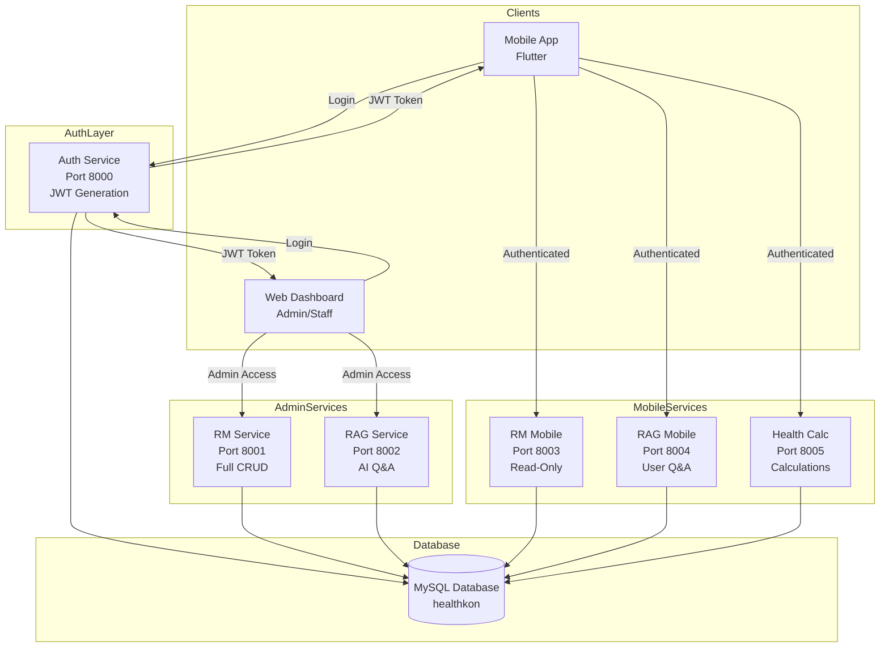
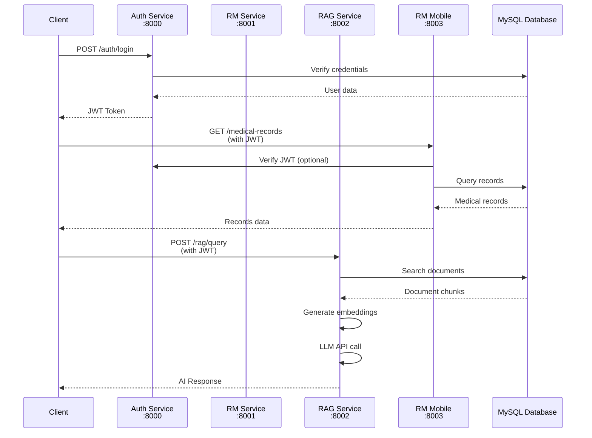
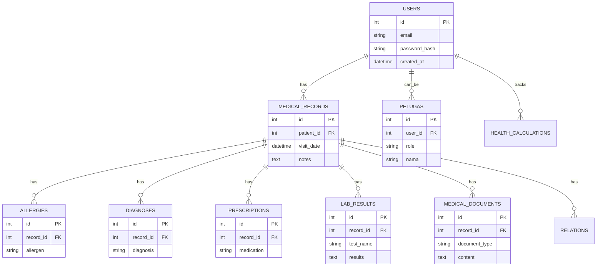

# Arsitektur Backend Healthkon BPJS

## 📋 Daftar Isi
1. [Overview](#overview)
2. [Arsitektur Mikroservice](#arsitektur-mikroservice)
3. [Diagram Arsitektur](#diagram-arsitektur)
4. [Detail Setiap Service](#detail-setiap-service)
5. [Database Architecture](#database-architecture)
6. [Komunikasi Antar Service](#komunikasi-antar-service)
7. [Teknologi yang Digunakan](#teknologi-yang-digunakan)

---

## Overview

Backend Healthkon BPJS menggunakan arsitektur **Microservices** dengan 6 service terpisah yang berjalan secara independen. Setiap service memiliki port dan fungsi spesifik, dengan pola **separation of concerns** yang jelas antara service untuk admin/staff dan service untuk user mobile.

### Karakteristik Arsitektur:
- ✅ **Microservices Architecture** - Setiap service independen
- ✅ **RESTful API** - Menggunakan FastAPI framework
- ✅ **Shared Database** - Semua service menggunakan database MySQL yang sama
- ✅ **JWT Authentication** - Token-based authentication
- ✅ **Service Separation** - Pemisahan service untuk admin dan mobile user

---

## Arsitektur Mikroservice

```
┌─────────────────────────────────────────────────────────────────┐
│                    BACKEND SERVICES ARCHITECTURE                │
└─────────────────────────────────────────────────────────────────┘

┌─────────────────────────────────────────────────────────────────┐
│                         CLIENT LAYER                            │
├─────────────────────────────────────────────────────────────────┤
│  Mobile App (Flutter)    │    Web Dashboard (Admin/Staff)      │
└─────────────────────────────────────────────────────────────────┘
                              │
                              ▼
┌─────────────────────────────────────────────────────────────────┐
│                      API GATEWAY LAYER                           │
│  (No dedicated gateway - Direct service access)                  │
└─────────────────────────────────────────────────────────────────┘
                              │
        ┌─────────────────────┼─────────────────────┐
        │                     │                     │
        ▼                     ▼                     ▼
┌──────────────┐    ┌──────────────────┐    ┌──────────────────┐
│   AUTH       │    │   ADMIN SERVICES │    │  MOBILE SERVICES │
│  Service     │    │                  │    │                  │
│  Port: 8000  │    │                  │    │                  │
└──────────────┘    └──────────────────┘    └──────────────────┘
        │                     │                     │
        │         ┌────────────┼────────────┐       │
        │         │            │            │       │
        ▼         ▼            ▼            ▼       ▼
┌──────────────┐ ┌────────┐ ┌────────┐ ┌────────┐ ┌────────┐
│   RM         │ │  RAG   │ │  RM    │ │  RAG   │ │ HEALTH │
│  Service     │ │ Service│ │ Mobile │ │ Mobile │ │ Calc   │
│  Port: 8001  │ │ Port:  │ │ Port:  │ │ Port:  │ │ Port:  │
│  (Admin)     │ │ 8002   │ │ 8003   │ │ 8004   │ │ 8005   │
└──────────────┘ └────────┘ └────────┘ └────────┘ └────────┘
        │             │            │            │            │
        └─────────────┴────────────┴────────────┴────────────┘
                              │
                              ▼
                    ┌─────────────────┐
                    │   MySQL Database│
                    │   (healthkon)   │
                    └─────────────────┘
```

---

## Diagram Arsitektur

### 0. Mermaid Diagrams (Visual)

#### Service Architecture Flow


#### Service Communication Flow


#### Database Architecture


### 1. Service Overview Diagram

```
┌──────────────────────────────────────────────────────────────────────┐
│                         SERVICE PORT MAPPING                         │
├──────────────────────────────────────────────────────────────────────┤
│                                                                      │
│  ┌──────────────────────────────────────────────────────────────┐  │
│  │  AUTHENTICATION SERVICE (Port 8000)                          │  │
│  │  ───────────────────────────────────────────────────────────  │  │
│  │  • User Authentication (Login/Register)                      │  │
│  │  • JWT Token Generation                                      │  │
│  │  • Petugas Management (Admin/Doctor/Staff)                   │  │
│  │  • Access: Public (for auth endpoints)                       │  │
│  └──────────────────────────────────────────────────────────────┘  │
│                                                                      │
│  ┌──────────────────────────────────────────────────────────────┐  │
│  │  ADMIN SERVICES (Internal/Staff Only)                         │  │
│  ├──────────────────────────────────────────────────────────────┤  │
│  │                                                               │  │
│  │  ┌──────────────────────┐  ┌──────────────────────┐         │  │
│  │  │  RM SERVICE          │  │  RAG SERVICE         │         │  │
│  │  │  Port: 8001          │  │  Port: 8002          │         │  │
│  │  │  ────────────────    │  │  ────────────────    │         │  │
│  │  │  • Medical Records   │  │  • RAG Q&A          │         │  │
│  │  │  • CRUD Operations   │  │  • Document Search  │         │  │
│  │  │  • Full Access       │  │  • AI-powered       │         │  │
│  │  │  • For Admin/Staff   │  │  • For Admin/Staff  │         │  │
│  │  └──────────────────────┘  └──────────────────────┘         │  │
│  │                                                               │  │
│  └──────────────────────────────────────────────────────────────┘  │
│                                                                      │
│  ┌──────────────────────────────────────────────────────────────┐  │
│  │  MOBILE SERVICES (User-Facing)                                │  │
│  ├──────────────────────────────────────────────────────────────┤  │
│  │                                                               │  │
│  │  ┌──────────────────────┐  ┌──────────────────────┐         │  │
│  │  │  RM MOBILE SERVICE   │  │  RAG MOBILE SERVICE  │         │  │
│  │  │  Port: 8003          │  │  Port: 8004          │         │  │
│  │  │  ────────────────    │  │  ────────────────    │         │  │
│  │  │  • Read-only Access  │  │  • User-friendly Q&A│         │  │
│  │  │  • View Records      │  │  • Simplified RAG    │         │  │
│  │  │  • For Users         │  │  • For Users         │         │  │
│  │  └──────────────────────┘  └──────────────────────┘         │  │
│  │                                                               │  │
│  │  ┌──────────────────────┐                                    │  │
│  │  │  HEALTH CALCULATOR   │                                    │  │
│  │  │  Port: 8005          │                                    │  │
│  │  │  ────────────────    │                                    │  │
│  │  │  • BMI Calculator    │                                    │  │
│  │  │  • Health Metrics    │                                    │  │
│  │  │  • For Users         │                                    │  │
│  │  └──────────────────────┘                                    │  │
│  │                                                               │  │
│  └──────────────────────────────────────────────────────────────┘  │
│                                                                      │
└──────────────────────────────────────────────────────────────────────┘
```

### 2. Data Flow Diagram

```
┌─────────────┐
│ Mobile App  │
└──────┬──────┘
       │
       │ 1. Login Request
       ▼
┌─────────────────┐
│ AUTH Service    │───► JWT Token
│ (Port 8000)     │
└─────────────────┘
       │
       │ 2. Authenticated Request (with JWT)
       │
       ├─────────────────┬─────────────────┬─────────────────┐
       │                 │                 │                 │
       ▼                 ▼                 ▼                 ▼
┌─────────────┐  ┌─────────────┐  ┌─────────────┐  ┌─────────────┐
│ RM Mobile   │  │ RAG Mobile  │  │ Health Calc │  │ RM Service  │
│ (Port 8003) │  │ (Port 8004) │  │ (Port 8005) │  │ (Port 8001) │
└──────┬──────┘  └──────┬──────┘  └──────┬──────┘  └──────┬──────┘
       │                 │                 │                 │
       └─────────────────┴─────────────────┴─────────────────┘
                              │
                              ▼
                    ┌─────────────────┐
                    │  MySQL Database  │
                    │   (healthkon)    │
                    └─────────────────┘
```

### 3. Service Internal Structure

Setiap service mengikuti pola arsitektur yang sama:

```
Service Structure:
├── main.py              # FastAPI app entry point
├── app.py               # App configuration (if exists)
├── core/
│   ├── config.py        # Configuration settings
│   ├── database.py      # Database connection (reuses auth service)
│   └── dependencies.py  # Dependency injection (if exists)
├── api/
│   └── routes/          # API endpoints/routers
├── models/              # SQLAlchemy ORM models
├── schemas/             # Pydantic schemas (request/response)
└── services/            # Business logic layer
```

---

## Detail Setiap Service

### 1. Authentication Service (Port 8000)
**Tujuan**: Mengelola autentikasi dan otorisasi pengguna

**Fitur**:
- User registration dan login
- JWT token generation dan validation
- Petugas management (Admin, Doctor, Staff)
- Password hashing dengan bcrypt

**Endpoints**:
- `POST /auth/register` - Registrasi user baru
- `POST /auth/login` - Login dan dapatkan token
- `GET /auth/me` - Get current user info
- `GET /petugas/` - List petugas (admin only)

**Database Models**:
- `User` - User accounts
- `Petugas` - Staff/Admin/Doctor accounts

---

### 2. RM Service (Port 8001) - Admin
**Tujuan**: Manajemen medical records untuk admin/staff

**Fitur**:
- Full CRUD operations untuk medical records
- Management allergies, diagnoses, prescriptions
- Lab results dan medical documents
- Patient management

**Endpoints**:
- `/medical-records/` - CRUD medical records
- `/patients/` - Patient management
- `/allergies/` - Allergy management
- `/diagnoses/` - Diagnosis management
- `/prescriptions/` - Prescription management
- `/lab-results/` - Lab results management
- `/medical-documents/` - Document management
- `/relations/` - Patient relations

**Access**: Admin, Doctor, Staff only

---

### 3. RAG Service (Port 8002) - Admin
**Tujuan**: AI-powered Q&A untuk medical records (admin/staff)

**Fitur**:
- Semantic search pada medical documents
- AI-powered question answering
- Document chunking dan embedding
- Vector similarity search

**Endpoints**:
- `POST /rag/query` - Query medical records dengan AI
- `POST /rag/search` - Semantic document search

**Technology**:
- OpenAI/OpenRouter API untuk LLM
- Text embeddings untuk semantic search
- Vector store (configurable: Pinecone, Qdrant, FAISS)

**Access**: Admin, Doctor, Staff only

---

### 4. RM Mobile Service (Port 8003) - User
**Tujuan**: Read-only access untuk medical records (user)

**Fitur**:
- View medical records (read-only)
- View allergies, diagnoses, prescriptions
- View lab results dan documents
- Patient relations view

**Endpoints**:
- `/medical-records/` - Get user's medical records
- `/allergies/` - Get user's allergies
- `/diagnoses/` - Get user's diagnoses
- `/prescriptions/` - Get user's prescriptions
- `/lab-results/` - Get user's lab results
- `/medical-documents/` - Get user's documents
- `/relations/` - Get user's relations

**Access**: Authenticated users (read-only)

---

### 5. RAG Mobile Service (Port 8004) - User
**Tujuan**: User-friendly AI Q&A untuk medical records

**Fitur**:
- Simplified RAG interface untuk users
- User-friendly question answering
- Access hanya ke medical records user sendiri

**Endpoints**:
- `POST /rag/query` - Query user's medical records

**Access**: Authenticated users (own records only)

---

### 6. Health Calculator Service (Port 8005) - User
**Tujuan**: Health calculation tools dan metrics

**Fitur**:
- BMI calculator
- Health metrics calculation
- Health tracking

**Endpoints**:
- `/calculator/` - Health calculations
- `/metrics/` - Health metrics

**Access**: Authenticated users

---

## Database Architecture

### Shared Database Pattern
Semua service menggunakan **shared MySQL database** (`healthkon`). Database connection diinisialisasi di `auth/core/database.py` dan di-reuse oleh service lain.

```
┌─────────────────────────────────────────────────────────┐
│              SHARED DATABASE ARCHITECTURE                │
├─────────────────────────────────────────────────────────┤
│                                                         │
│  ┌──────────┐  ┌──────────┐  ┌──────────┐  ┌─────────┐│
│  │  AUTH    │  │   RM     │  │   RAG    │  │  HEALTH ││
│  │ Service  │  │ Service  │  │ Service  │  │  Calc   ││
│  └────┬─────┘  └────┬─────┘  └────┬─────┘  └────┬────┘│
│       │             │             │             │      │
│       └─────────────┴─────────────┴─────────────┘      │
│                        │                                │
│                        ▼                                │
│              ┌──────────────────┐                       │
│              │  MySQL Database  │                       │
│              │   (healthkon)    │                       │
│              │                  │                       │
│              │  Tables:         │                       │
│              │  • users         │                       │
│              │  • petugas       │                       │
│              │  • medical_records│                      │
│              │  • patients      │                       │
│              │  • allergies     │                       │
│              │  • diagnoses     │                       │
│              │  • prescriptions │                       │
│              │  • lab_results   │                       │
│              │  • medical_documents│                   │
│              │  • health_calculations│                 │
│              └──────────────────┘                       │
│                                                         │
└─────────────────────────────────────────────────────────┘
```

### Database Connection Reuse
```python
# auth/core/database.py - Main database connection
engine = create_engine(DATABASE_URL, ...)
SessionLocal = sessionmaker(bind=engine)
Base = declarative_base()

# Other services reuse this:
# rm_service/core/database.py
from auth.core.database import engine, Base, get_db

# rag_service/core/database.py
from auth.core.database import engine, Base, get_db
```

---

## Komunikasi Antar Service

### 1. Authentication Flow
```
Client → AUTH Service (8000) → JWT Token
Client → Other Services (with JWT) → Verify Token → Process Request
```

### 2. Service-to-Service Communication
- **No direct service-to-service calls** - Services are independent
- **Shared database** - Services communicate through database
- **JWT tokens** - Used for authentication across services

### 3. Request Flow Example
```
1. User Login:
   Mobile App → AUTH Service (8000) → Database → JWT Token → Mobile App

2. View Medical Records:
   Mobile App → RM Mobile (8003) → Verify JWT → Database → Return Records

3. AI Q&A:
   Mobile App → RAG Mobile (8004) → Verify JWT → Database → 
   → Embedding Search → LLM API → Response → Mobile App
```

---

## Teknologi yang Digunakan

### Framework & Libraries
- **FastAPI** - Web framework untuk REST API
- **Uvicorn** - ASGI server
- **SQLAlchemy** - ORM untuk database
- **Pydantic** - Data validation dan serialization
- **PyMySQL** - MySQL database driver
- **PyJWT** - JWT token handling
- **Passlib** - Password hashing (bcrypt)
- **Python-dotenv** - Environment configuration

### AI/ML Stack
- **OpenAI API** / **OpenRouter** - LLM untuk RAG
- **Text Embeddings** - Semantic search (text-embedding-ada-002)
- **Vector Store** - Configurable (Pinecone, Qdrant, FAISS)

### Database
- **MySQL** - Relational database
- **Connection Pooling** - QueuePool dengan SQLAlchemy

### Development Tools
- **Python 3.x** - Programming language
- **Virtual Environment** - venv untuk dependency isolation

---

## Service Deployment

### Running Services
Services dapat dijalankan dengan beberapa cara:

1. **Run All Services** (recommended):
   ```bash
   python running.py
   ```

2. **Run Individual Service**:
   ```bash
   python running.py --service auth
   python running.py --service rm
   python running.py --service rag
   python running.py --service rm_mobile
   python running.py --service rag_mobile
   python running.py --service health_calc
   ```

### Service Ports Summary
| Service | Port | Purpose | Access Level |
|---------|------|---------|--------------|
| AUTH | 8000 | Authentication | Public |
| RM Service | 8001 | Medical Records (Admin) | Admin/Staff |
| RAG Service | 8002 | RAG Q&A (Admin) | Admin/Staff |
| RM Mobile | 8003 | Medical Records (User) | Authenticated Users |
| RAG Mobile | 8004 | RAG Q&A (User) | Authenticated Users |
| Health Calc | 8005 | Health Calculator | Authenticated Users |

---

## Arsitektur Pattern

### 1. Layered Architecture
Setiap service mengikuti **3-layer architecture**:
- **API Layer** (`api/routes/`) - HTTP endpoints
- **Service Layer** (`services/`) - Business logic
- **Data Layer** (`models/`, `core/database.py`) - Database access

### 2. Dependency Injection
- FastAPI dependency system untuk database sessions
- Reusable dependencies di `core/dependencies.py`

### 3. Schema Validation
- **Pydantic schemas** untuk request/response validation
- Separation antara database models (SQLAlchemy) dan API schemas (Pydantic)

### 4. Configuration Management
- Environment variables via `.env` file
- Centralized config di `core/config.py`
- Auto-detection untuk MySQL port

---

## Security Architecture

### Authentication & Authorization
- **JWT-based authentication** - Stateless token system
- **Token expiration** - Configurable (default: 30 days)
- **Password hashing** - bcrypt dengan salt
- **Role-based access** - Admin, Doctor, Staff, User

### Service Isolation
- **Port separation** - Each service on different port
- **Read-only services** - Mobile services are read-only
- **Admin separation** - Admin services separate from user services

---

## Scalability Considerations

### Current Architecture
- **Monolithic database** - Shared MySQL database
- **Independent services** - Can scale individually
- **Stateless services** - JWT-based, no session storage

### Future Improvements
- **Database sharding** - If needed for scale
- **API Gateway** - For centralized routing and rate limiting
- **Service mesh** - For service-to-service communication
- **Caching layer** - Redis for frequently accessed data
- **Message queue** - For async processing

---

## Monitoring & Logging

### Current Setup
- **Uvicorn logging** - Built-in FastAPI/Uvicorn logs
- **Colored logs** - Service-specific colors in `running.py`
- **Real-time monitoring** - Log streaming when running all services

### Recommended Additions
- **Structured logging** - JSON logs for better parsing
- **Health check endpoints** - `/health` endpoints
- **Metrics collection** - Prometheus/Grafana
- **Error tracking** - Sentry or similar

---

## Kesimpulan

Backend Healthkon BPJS menggunakan arsitektur **microservices** yang terorganisir dengan baik, dengan pemisahan yang jelas antara:
- **Authentication service** - Central auth
- **Admin services** - Full CRUD operations
- **Mobile services** - User-facing, read-only
- **Specialized services** - Health calculator

Arsitektur ini memungkinkan:
- ✅ **Independent deployment** - Each service can be deployed separately
- ✅ **Scalability** - Services can scale independently
- ✅ **Maintainability** - Clear separation of concerns
- ✅ **Security** - Role-based access control
- ✅ **Flexibility** - Easy to add new services

---

*Dokumen ini dibuat untuk dokumentasi arsitektur backend Healthkon BPJS*
*Last Updated: 2024*

